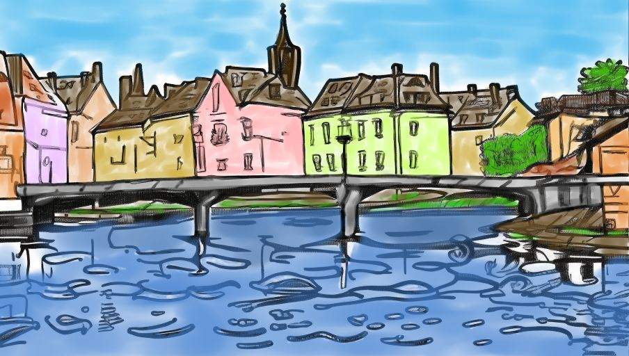
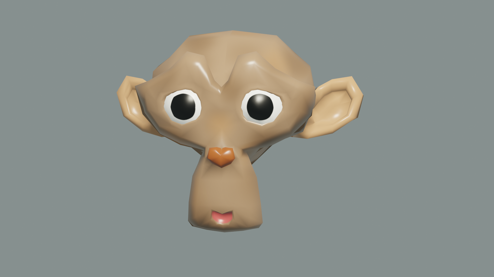
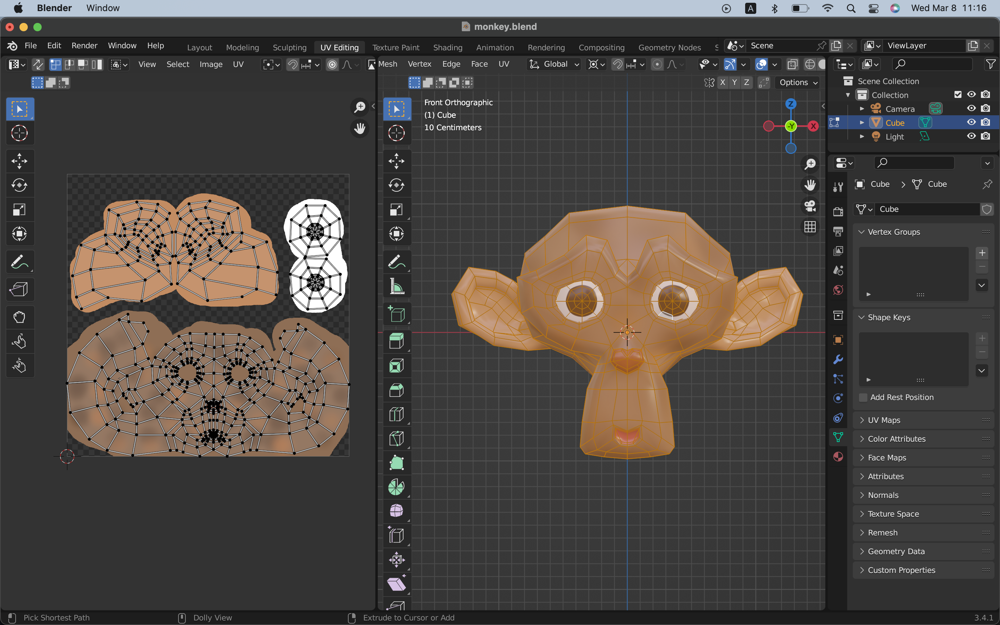
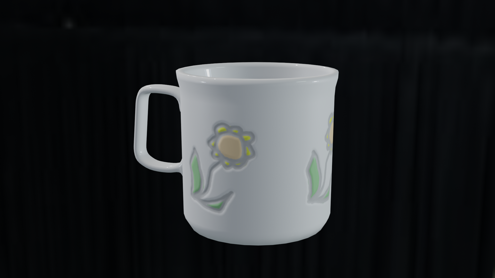
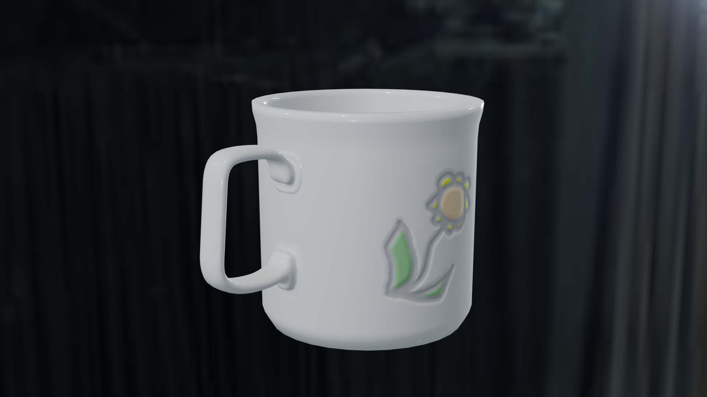
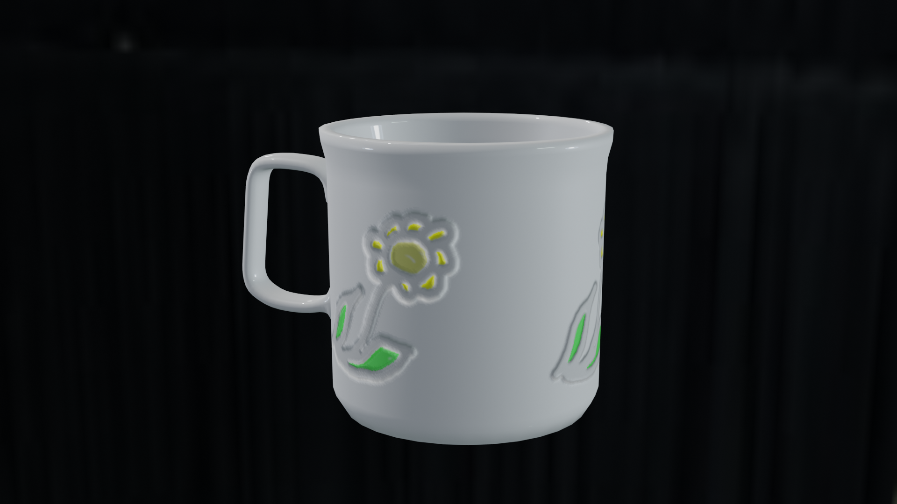
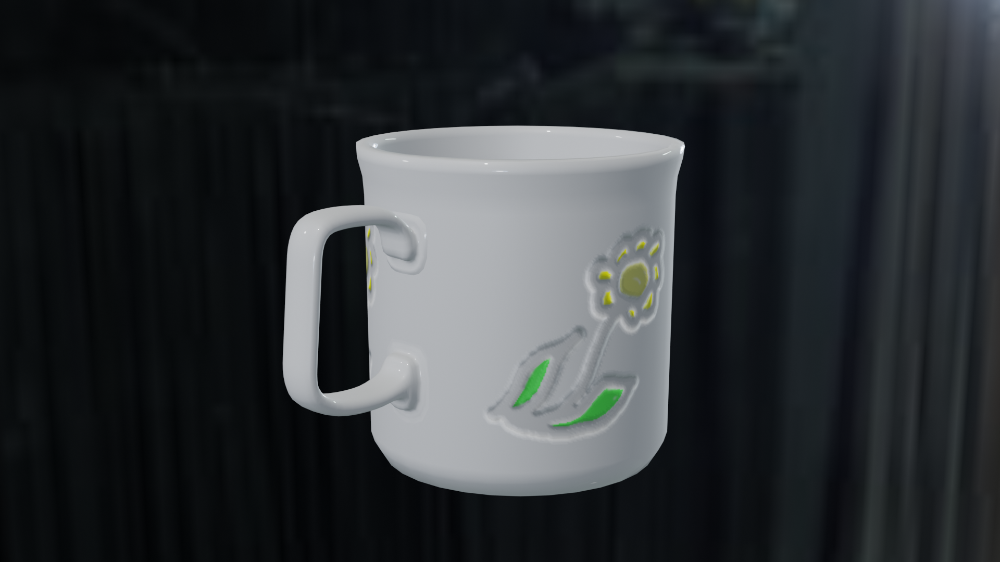

# Krita and GIMP

## Krita

### Non-AI-generated 2D art with Wacom One

(Work in progress)

- [Tokyo Disney Sea](./krita/DisneySea)

### AI-generated Coloring Books

I used AUTOMATIC1111/StableDiffusion to generate a French town line art in Edouard Manet's style, then used Krita for coloring.

- [French town](./krita/generative_ai/french_town)

### Suzanne (Blender)

- [Monkey](./krita/monkey)

### Coffee Cup

I have got that Krita can generate normal maps as well.

- [Coffee Cup](./krita/cup)

## GIMP

### Coffee Cup

- [Coffee Cup](./gimp/cup)

### Others

- [Brick](./gimp/brick)
- [Circuit](./gimp/circuit)
